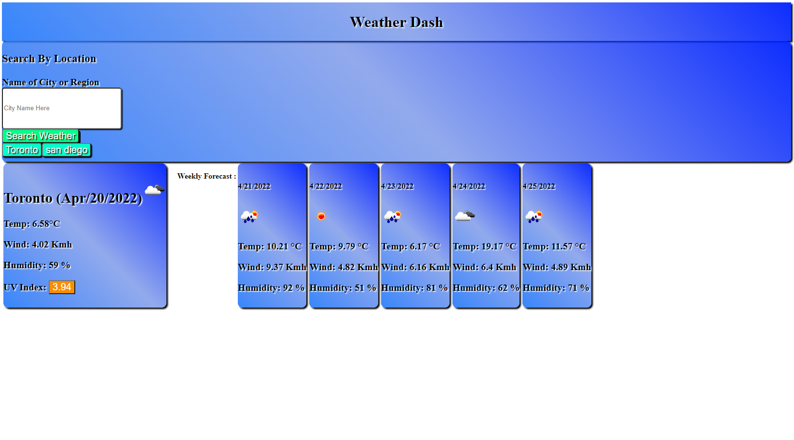
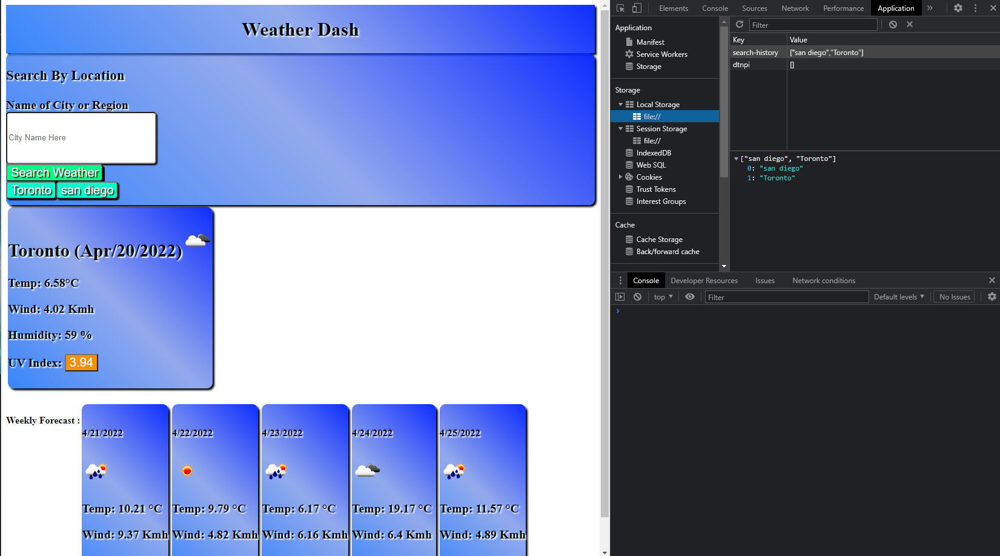
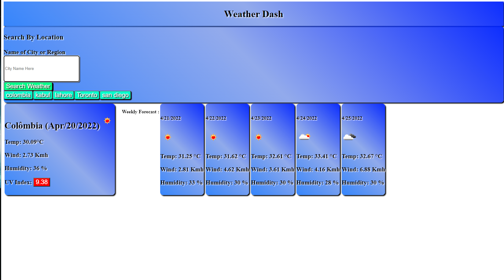

# Weather-Cast
 

---
 
 
 

 
 
 

---

 

## User Story

AS A traveler
I WANT to see the weather outlook for multiple cities
SO THAT I can plan a trip accordingly

---

## Acceptance Criteria

GIVEN a weather dashboard with form inputs
WHEN I search for a city
THEN I am presented with current and future conditions for that city and that city is added to the search history
WHEN I view current weather conditions for that city
THEN I am presented with the city name, the date, an icon representation of weather conditions, the temperature, the humidity, the wind speed, and the UV index
WHEN I view the UV index
THEN I am presented with a color that indicates whether the conditions are favorable, moderate, or severe
WHEN I view future weather conditions for that city
THEN I am presented with a 5-day forecast that displays the date, an icon representation of weather conditions, the temperature, the wind speed, and the humidity
WHEN I click on a city in the search history
THEN I am again presented with current and future conditions for that city

---

## Description

- Weather-cast is a mobile weather forecast application. It uses a weather api to fetch current weather data, as well as a 5 day forecast. It employs localStorage to save search histories so that the user is not required to re-enter data that has already been fetched. When app is initiatiated, saved entries from localStorage are retrieved and displayed below the search window for user convenience. The UVI indicator changes color based on the severity of the index. If UVI is below 3, the indicator will be green, if it is between 3 an d 7 it will be orange and above 7 will show a red indicator. 

---

## Usage

- The application is deployed online. Please click link below to view. Enter a city or region into the text field and click search. The app will show today's weather data and the 5 day forecast for selected reagion.

---

## Screenshots

 

 

 

 

---

## Links

Github Repository:

 - https://github.com/Vithursan6/Weather-Cast

Deployed Application:

- https://vithursan6.github.io/Weather-Cast/

---

## License

MIT License

Copyright (c) 2022 Vithursan6

Permission is hereby granted, free of charge, to any person obtaining a copy
of this software and associated documentation files (the "Software"), to deal
in the Software without restriction, including without limitation the rights
to use, copy, modify, merge, publish, distribute, sublicense, and/or sell
copies of the Software, and to permit persons to whom the Software is
furnished to do so, subject to the following conditions:

The above copyright notice and this permission notice shall be included in all
copies or substantial portions of the Software.

THE SOFTWARE IS PROVIDED "AS IS", WITHOUT WARRANTY OF ANY KIND, EXPRESS OR
IMPLIED, INCLUDING BUT NOT LIMITED TO THE WARRANTIES OF MERCHANTABILITY,
FITNESS FOR A PARTICULAR PURPOSE AND NONINFRINGEMENT. IN NO EVENT SHALL THE
AUTHORS OR COPYRIGHT HOLDERS BE LIABLE FOR ANY CLAIM, DAMAGES OR OTHER
LIABILITY, WHETHER IN AN ACTION OF CONTRACT, TORT OR OTHERWISE, ARISING FROM,
OUT OF OR IN CONNECTION WITH THE SOFTWARE OR THE USE OR OTHER DEALINGS IN THE
SOFTWARE.

---

## Author

Vithursan6
- github https://github.com/Vithursan6